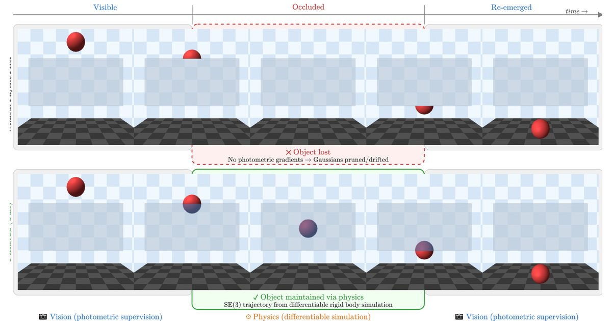

# PersistGS: Differentiable Physics for Object Permanence in 4D Gaussian Splatting

[Adrian Ramlal](https://adrian-ramlal.github.io/) and [John S. Zelek](https://uwaterloo.ca/systems-design-engineering/profile/jzelek), University of Waterloo

CVPR 2026 Workshop on Generative 3D Reconstruction (Oral). Also presented at the ICRA 2026 Real2Sim/Sim2Real Workshop (non-archival).

[Project page](https://adrian-ramlal.github.io/PersistGS/) | [Paper](https://openaccess.thecvf.com/content/CVPR2026W/GenRecon3d/papers/Ramlal_PersistGS_Differentiable_Physics_for_Object_Permanence_in_4D_Gaussian_Splatting_CVPRW_2026_paper.pdf) | [arXiv](https://arxiv.org/abs/2606.03479)



*Top: without a physics prior, the hidden ball gets no photometric gradients and its Gaussians are pruned or drift. Bottom: PersistGS moves it along an SE(3) trajectory from differentiable rigid-body simulation.*

PersistGS keeps fully occluded objects in a 4D Gaussian Splatting reconstruction. It estimates friction and initial velocity from the frames where the object is visible, then simulates the hidden motion with a differentiable rigid-body simulator (NVIDIA Newton). On three synthetic scenes, PSNR during occlusion is 2.46 dB above constant-velocity extrapolation and within 0.19 dB of using the ground-truth trajectory.

## Abstract

Dynamic 3D Gaussian Splatting (3DGS) methods reconstruct time-varying scenes from synchronized multi-camera video using photometric supervision. When a moving object becomes fully occluded from all training cameras, this supervision vanishes: the Gaussians representing it receive no gradient signal and degrade. Existing approaches to incomplete observations in neural reconstruction rely on learned generative priors that prioritize visual plausibility over physical correctness.

We propose PersistGS, a method that restores object permanence during occlusion by coupling differentiable rigid body simulation with 3D Gaussian Splatting. Our approach decomposes the scene into per-object Gaussians and collision meshes, estimates friction and velocity from the observed pre-occlusion trajectory via differentiable simulation, and uses the resulting SE(3) trajectory to position object Gaussians throughout the occlusion period. Because the predicted trajectory satisfies the governing equations of rigid body dynamics, it faithfully captures contact events (bounces, friction-based deceleration, direction changes) that kinematic extrapolation cannot model. We introduce a centroid silhouette loss that isolates positional gradients from appearance noise, yielding 40% lower trajectory error than photometric supervision. We evaluate using cameras withheld from training that observe the object during its occlusion. Experiments on synthetic scenes show that PersistGS outperforms constant velocity extrapolation by +2.46 dB PSNR and comes within 0.19 dB of a ground-truth trajectory upper bound.

## Citation

```bibtex
@InProceedings{ramlal2026persistgs,
    author    = {Ramlal, Adrian and Zelek, John S.},
    title     = {PersistGS: Differentiable Physics for Object Permanence in 4D Gaussian Splatting},
    booktitle = {Proceedings of the IEEE/CVF Conference on Computer Vision and Pattern Recognition (CVPR) Workshops},
    month     = {June},
    year      = {2026},
    pages     = {4687-4696}
}
```

## About this repository

This repository holds the source of the project page. It is plain HTML adapted from the [Nerfies](https://github.com/nerfies/nerfies.github.io) template and served by GitHub Pages. To preview it locally, run `python3 -m http.server` in this folder and open http://localhost:8000.

Like the template, the page is licensed under [CC BY-SA 4.0](https://creativecommons.org/licenses/by-sa/4.0/).
